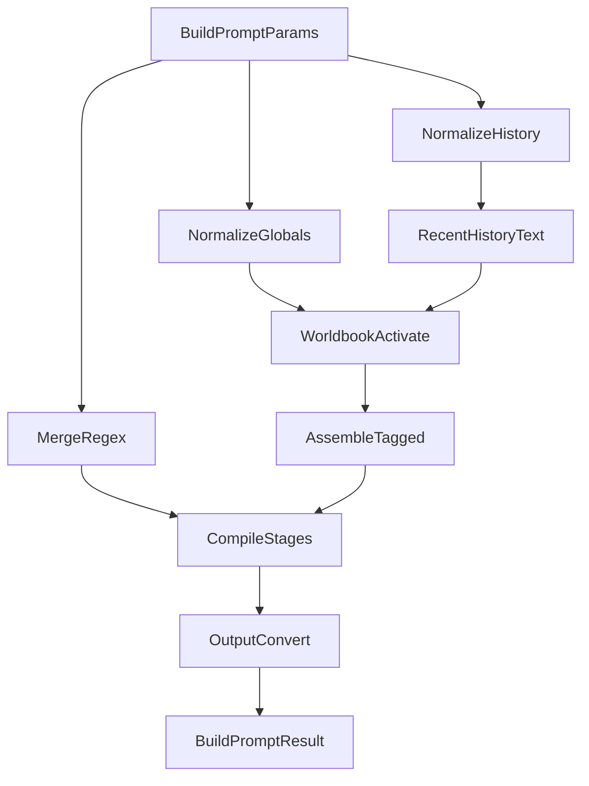

## fast-tavern（总览）

`fast-tavern` 是一个**与框架无关**的“提示词组装与调试引擎（prompt engine）”，对齐 SillyTavern 生态里 `st-api-wrapper` 的**新格式字段**：把 **预设（Preset）/ 世界书（WorldBook）/ 角色卡（Character）/ 正则脚本（RegexScriptData）/ 宏与变量 / 聊天历史（ChatMessage）** 按固定流水线组装，并输出**可调试的多阶段结果**，便于 UI 预览与定位问题。

本仓库是一个“总仓库”，同时提供：
- **TypeScript / NPM 包**：位于 [`npm-fast-tavern/`](npm-fast-tavern/)
- **Python / PyPI 包**：位于 [`py-fast-tavern/`](py-fast-tavern/)

---

## 你会得到什么

- **可复刻酒馆的提示词组装逻辑**：把 preset/世界书/角色卡/历史/变量合成最终 messages（或 text），而不依赖具体前端框架。
- **多阶段调试输出**：同一份输入，可以看到每一段文本在不同阶段的变化：
  - `raw`
  - `afterPreRegex`（为兼容保留：当前等同 `raw`）
  - `afterMacro`
  - `afterPostRegex`（最终）
- **世界书激活与注入**：`always/keyword/vector`（vector 通过 hook），支持 probability 与递归控制。
- **RegexScriptData 对齐实现**：targets/view/trim/{{match}}/macroMode/minDepth/maxDepth。
- **变量系统（any）**：local/global 两个 scope，支持 `getvar/setvar/getglobalvar/setglobalvar` 宏，并提供 `Variables.*` 操作 API。
- **输出格式转换**：`gemini/openai/tagged/text`。

---

## 仓库结构

```text
fast-tavern/
  npm-fast-tavern/        # TypeScript 版本（发布到 NPM）
    docs/                 # 详细文档（格式/流程/API/教程）
    src/                  # 源码
    test/                 # 用例（依赖 dist）
  py-fast-tavern/         # Python 版本（发布到 PyPI）
    src/fast_tavern/      # 源码（src-layout）
    tests/                # pytest 对齐用例（复刻 TS 测试）
```

---

## 快速开始（TypeScript / NPM）

### 安装

```bash
npm i fast-tavern
```

### 最小示例

```ts
import { buildPrompt, History } from 'fast-tavern';

const result = buildPrompt({
  preset,       // PresetInfo
  character,    // CharacterCard（可选）
  globals: {
    worldBooks,
    regexScripts,
  },

  // 聊天记录（ChatMessage[]）
  history: History.openai([
    { role: 'system', content: 'You are a helpful assistant.' },
    { role: 'user', content: 'Hello' },
    { role: 'assistant', content: 'Hi!' },
  ]),

  // 正则视图：user / model
  view: 'model',

  // 宏（可选）
  macros: { user: 'Bob' },

  // 变量（any）
  variables: { score: 1, cfg: { a: 1 } },

  // 输出格式：gemini/openai/text/tagged
  outputFormat: 'openai',

  // system 输出策略
  systemRolePolicy: 'keep',
});

console.log(result.stages.tagged.afterPostRegex);  // UI 预览最推荐
console.log(result.stages.output.afterPostRegex);  // 最终输出
```

### 在仓库内开发/测试（TS）

在 [`npm-fast-tavern/`](npm-fast-tavern/) 下执行：

```bash
npm i
npm run build
npm test
```

> 说明：TS 测试脚本依赖 `dist` 产物，`npm test` 会先 build。

---

## 快速开始（Python / PyPI）

### 安装（发布后）

```bash
pip install fast-tavern
```

### 最小示例

```python
from fast_tavern import build_prompt, History

result = build_prompt(
    preset=preset,
    character=character,
    globals={"worldBooks": world_books, "regexScripts": regex_scripts},
    history=History.openai(
        [
            {"role": "system", "content": "You are a helpful assistant."},
            {"role": "user", "content": "Hello"},
            {"role": "assistant", "content": "Hi!"},
        ]
    ),
    view="model",
    macros={"user": "Bob"},
    variables={"score": 1, "cfg": {"a": 1}},
    output_format="openai",
    system_role_policy="keep",
)

print(result["stages"]["tagged"]["afterPostRegex"])
print(result["stages"]["output"]["afterPostRegex"])
```

### 在仓库内开发/测试（Python）

在 [`py-fast-tavern/`](py-fast-tavern/) 下执行：

```bash
pip install -e .[dev]
pytest
```

---

## buildPrompt / build_prompt 的核心产物（你应该看哪里）

返回结构里最常用的是：
- **`result.stages.tagged.afterPostRegex`**：带 `tag/target/role/text` 的列表，最适合做“可解释 UI”与问题定位。
- **`result.stages.output.afterPostRegex`**：最终输出（`openai/gemini/text/tagged` 取决于 outputFormat）。
- **`result.stages.perItem`**：逐条条目在 4 个阶段的文本快照（便于精确定位是哪条改坏了）。
- **`result.variables.local/global`**：变量最终状态（global 需要调用方持久化）。

---

## 组装流水线概览



---

## 关键行为说明（容易踩坑的点）

### system role 策略

- **引擎内部保留 `system`**（不会提前降级）。
- 仅对最终输出（`stages.output.*`）生效：
  - **`systemRolePolicy=keep`**：保留 system
  - **`systemRolePolicy=to_user`**：将 system 降级为 user（内容不变，仅角色变）

### view 过滤（user/model）

- 正则脚本 `view=['user']`：只在 `view='user'`（显示侧）生效  
- 正则脚本 `view=['model']`：只在 `view='model'`（发送侧）生效

### depth/order 注入规则（fixed）

- `position=fixed` 的 preset prompt 与世界书 entry 会“注入进 chatHistory 段”。
- 规则：先按 `depth`，再按 `order` 排序，然后执行插入：
  - `targetIndex = max(0, dialogueList.length - depth)`

### 变量宏（any）

支持：
- `{{getvar::name}}` / `<<getvar::name>>`
- `{{setvar::name::value}}` / `<<setvar::name::value>>`
- `{{getglobalvar::name}}`
- `{{setglobalvar::name::value}}`

约定：
- `getvar/getglobalvar` 读到 object 会 JSON 化（失败则 String 化）

### RegexScriptData 语义

- `findRegex` 支持：
  - `"/pattern/flags"`（推荐）
  - `"pattern"`（无 flags）
- `replaceRegex` 支持：
  - `{{match}}` 与 `$&`：使用 **Trim Out 后的 match**
  - `$1..$99`：捕获组（不做 Trim）
- `trimRegex`：对每次 match 做字符串移除，再参与 `{{match}}/$&`。
- `minDepth/maxDepth`：仅对聊天历史（targets=userInput/aiOutput）生效。

> Python 版的 flags 映射说明见 [`py-fast-tavern/README.md`](py-fast-tavern/README.md)。

---

## 文档入口（建议从这里开始读）

TypeScript 版本的详细文档位于：
- **格式与组装流程（详细）**：[`npm-fast-tavern/docs/FORMAT_ZH.md`](npm-fast-tavern/docs/FORMAT_ZH.md)
- **API 文档**：[`npm-fast-tavern/docs/API_ZH.md`](npm-fast-tavern/docs/API_ZH.md)
- **使用教程（含输出示例）**：[`npm-fast-tavern/docs/GUIDE_ZH.md`](npm-fast-tavern/docs/GUIDE_ZH.md)

Python 版本的说明与差异点：
- [`py-fast-tavern/README.md`](py-fast-tavern/README.md)

---

## 发布流程提示（你们自行执行）

### NPM（TypeScript）

在 [`npm-fast-tavern/`](npm-fast-tavern/)：

```bash
npm i
npm run build
# 然后按你们的发布流程执行 npm publish（是否需要登录/Tag/2FA 由你们环境决定）
```

### PyPI（Python）

在 [`py-fast-tavern/`](py-fast-tavern/)：

```bash
pip install build twine
python -m build
twine upload dist/*
```

---

## 许可证

MIT

