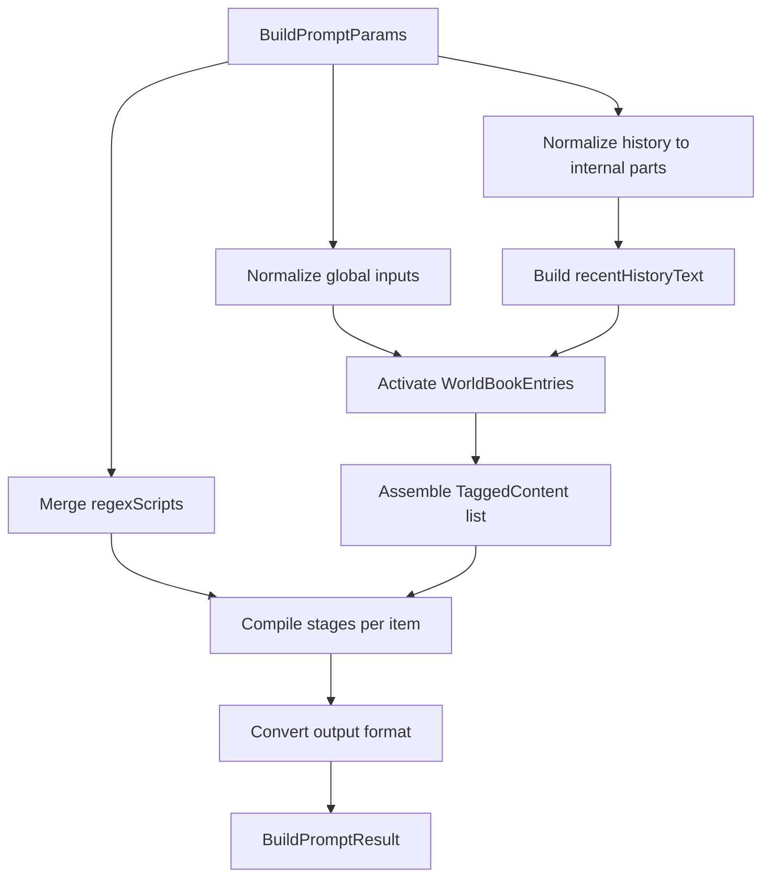

### fast-tavern：格式与组装流程（对齐 `st-api-wrapper` 新格式）

本文档描述主项目 `fast-tavern` 使用的**新格式字段**（与 `st-api-wrapper` 对齐），以及 `buildPrompt()` 的**组装/编译流水线**：如何把预设、世界书、正则、角色卡、聊天历史、变量组装成最终输出。

> 约定：本文的“文件格式”指你在调用 `buildPrompt()` 时传入的对象结构（可以来自 JSON 文件/数据库/接口），并不要求一定落盘为文件。

---

### 1. 入口与核心文件

- **入口 API**
  - `buildPrompt(params)`：[`src/core/modules/build/buildPrompt.ts`](../src/core/modules/build/buildPrompt.ts)
- **类型定义（权威字段）**
  - [`src/core/types.ts`](../src/core/types.ts)
- **装配与管道**
  - 组装 tagged 列表：[`src/core/modules/assemble/assembleTaggedPromptList.ts`](../src/core/modules/assemble/assembleTaggedPromptList.ts)
  - 内容分阶段处理：[`src/core/modules/pipeline/compileTaggedStages.ts`](../src/core/modules/pipeline/compileTaggedStages.ts)
  - 单条内容处理（宏+变量宏+正则）：[`src/core/modules/pipeline/processContentStages.ts`](../src/core/modules/pipeline/processContentStages.ts)
- **世界书**
  - 归一化多文件：[`src/core/modules/inputs/normalizeWorldbooks.ts`](../src/core/modules/inputs/normalizeWorldbooks.ts)
  - 激活条目：[`src/core/modules/worldbook/getActiveEntries.ts`](../src/core/modules/worldbook/getActiveEntries.ts)
- **正则**
  - 归一化多文件：[`src/core/modules/inputs/normalizeRegexes.ts`](../src/core/modules/inputs/normalizeRegexes.ts)
  - 执行正则脚本：[`src/core/modules/regex/applyRegex.ts`](../src/core/modules/regex/applyRegex.ts)
  - 合并脚本：[`src/core/modules/regex/mergeRegexRules.ts`](../src/core/modules/regex/mergeRegexRules.ts)
- **变量**
  - 变量上下文/宏处理/Variables API：[`src/core/modules/variables/variableContext.ts`](../src/core/modules/variables/variableContext.ts)
- **输出转换（gemini/openai/text）**
  - [`src/core/convert.ts`](../src/core/convert.ts)

---

### 2. 数据结构与“文件格式”

#### 2.1 聊天历史（ChatMessage）

对齐 `st-api-wrapper`：一条消息要么是 **Gemini parts** 结构，要么是 **OpenAI content** 结构。

```json
[
  { "role": "system", "content": "SYS" },
  { "role": "user", "content": "你好" },
  { "role": "assistant", "content": "OK" }
]
```

或（多模态/parts）：

```json
[
  {
    "role": "user",
    "parts": [
      { "text": "看图" },
      { "fileData": { "mimeType": "image/png", "fileUri": "https://..." } }
    ]
  }
]
```

字段要点：
- `role`: 任意字符串；内部会归一化为 `system|user|model`（`assistant` 会当作 `model`）。
- `name?`：可选发送者名。
- `swipeId?/swipes?`：可选分支信息（本引擎不会主动生成分支，但会原样保留/透传）。

#### 2.2 预设（PresetInfo / PromptInfo）

对齐 `st-api-wrapper/src/apis/preset/types.ts` 的核心字段：

```json
{
  "name": "Default",
  "apiSetting": {},
  "regexScripts": [],
  "prompts": [
    {
      "identifier": "main",
      "name": "Main",
      "enabled": true,
      "index": 0,
      "role": "system",
      "content": "你是一个有用的助手。{{getvar::score}}",
      "depth": 0,
      "order": 100,
      "trigger": [],
      "position": "relative"
    }
  ]
}
```

关键规则：
- **relative**：作为“骨架块/占位块”按顺序输出；`depth/order` 不影响注入（可保留给 UI 排序）。
- **fixed**：作为“注入块”，会插入到 `chatHistory` 占位块内部，按 `depth/order` 插入（见 3.2）。
- `enabled=false`：该 prompt 不参与装配与注入。

#### 2.3 世界书（WorldBook / WorldBookEntry）

对齐 `st-api-wrapper/src/apis/worldbook/types.ts` 的字段：

```json
{
  "name": "MyWorld",
  "entries": [
    {
      "index": 1,
      "name": "城市设定",
      "content": "故事发生在新星港……",
      "enabled": true,
      "activationMode": "keyword",
      "key": ["新星港"],
      "secondaryKey": [],
      "selectiveLogic": "andAny",
      "order": 0,
      "depth": 0,
      "position": "beforeChar",
      "role": null,
      "caseSensitive": null,
      "excludeRecursion": false,
      "preventRecursion": false,
      "probability": 100,
      "other": {}
    }
  ]
}
```

字段含义（本引擎实现的部分）：
- `activationMode`
  - `always`: 始终激活
  - `keyword`: 关键词激活（见 3.1）
  - `vector`: 通过 `options.vectorSearch` hook 激活（默认不触发）
- `position`
  - `beforeChar/afterChar/.../outlet`: **插槽条目**，需要映射到某个 preset prompt.identifier 才会插入
  - `fixed`: **注入条目**，会插入到 `chatHistory` 内部，使用 `depth/order`
- `role`：仅 `position=fixed` 时有意义；否则通常为 `null`

#### 2.4 正则脚本（RegexScriptData）

对齐 `st-api-wrapper/src/apis/regexScript/types.ts` 的字段：

```json
{
  "id": "remove-xml",
  "name": "Remove XML Tags",
  "enabled": true,
  "findRegex": "/<([a-zA-Z0-9]+)>(.|\\n)*?<\\/\\1>/gi",
  "replaceRegex": "",
  "trimRegex": [],
  "targets": ["aiOutput"],
  "view": ["user"],
  "runOnEdit": true,
  "macroMode": "none",
  "minDepth": null,
  "maxDepth": null
}
```

实现要点：
- `findRegex` 支持两种写法：
  - `"/pattern/flags"`（推荐，flags 支持 `gimsuy`）
  - `"pattern"`（默认无 flags）
- `replaceRegex` 支持：
  - `{{match}}`：替换为“Trim Out 之后的 match”
  - `$&`：同上（Trim Out 后的 match）
  - `$1..$99`：捕获组（不做 Trim）
- `trimRegex`：对每次匹配到的 `match` 先做字符串移除，再用于 `{{match}}/$&`
- `targets`（Affects）：
  - `userInput`：用户历史消息
  - `aiOutput`：模型历史消息
  - `slashCommands`：预设 prompt 内容/注入块（本引擎把“非历史的注入文本”统一归到这里）
  - `worldBook`：世界书条目内容
  - `reasoning`：当前引擎未单独产出 reasoning 块；若你把 reasoning 当文本注入，可自行标 target=reasoning
- `view`
  - `user`：仅用于“显示侧”
  - `model`：仅用于“发送侧”
- `minDepth/maxDepth`：仅对 `userInput/aiOutput` 生效（depth=0 表示最后一条历史消息）
- `macroMode`：**只影响 findRegex** 中的 `{{user}}/{{char}}` 这类宏替换
  - `none`: 不替换宏
  - `raw`: 直接替换为宏值
  - `escaped`: 替换为“正则转义后的宏值”

#### 2.5 角色卡（CharacterCard）

对齐 `st-api-wrapper/src/apis/character/types.ts` 的字段（本引擎目前只用到其中一部分）：

```json
{
  "name": "Alice",
  "description": "......",
  "avatar": "Alice.png",
  "message": ["首条消息"],
  "worldBook": { "name": "Alice", "entries": [] },
  "regexScripts": [],
  "other": {},
  "chatDate": "2025-...",
  "createDate": "2025-..."
}
```

本引擎行为：
- `character.worldBook` 会参与世界书激活（优先级高于 global）
- `character.regexScripts` 会与 global/preset 的脚本合并
- 宏目前只做简单的 `char` 提取：默认 `{{char}}` 使用 `character.name`（若调用方未显式传入 `macros.char`）

#### 2.6 变量（VariableContext / Variables API）

对齐 `st-api-wrapper/src/apis/variables/types.ts` 的语义：
- 两个作用域：`local`（本次构建局部）与 `global`（由调用方维护的跨构建状态）
- **值类型为 any**（数字、字符串、对象都允许）

变量宏（不扩展宏体系，仅对齐变量）：
- `{{getvar::name}} / <<getvar::name>>`
- `{{setvar::name::value}} / <<setvar::name::value>>`（value 仍为简单字符串）
- `{{getglobalvar::name}}`
- `{{setglobalvar::name::value}}`

当 `getvar/getglobalvar` 读到非字符串时：
- number/bool/bigint：`String(v)`
- object：`JSON.stringify(v)`（失败则 `String(v)`）

额外：提供了对齐 wrapper 风格的操作函数（纯本地、无 UI/保存副作用）：

```js
import { Variables, createVariableContext } from 'fast-tavern';

const ctx = createVariableContext({ score: 1 }, { g: 10 });
Variables.add(ctx, { name: 'score', value: 2 }); // => 3
Variables.inc(ctx, { name: 'score' });          // => 4
Variables.list(ctx, { scope: 'local' });        // => { variables: { score: 4 } }
```

---

### 3. 组装流程（buildPrompt）

#### 3.1 总体流程图



#### 3.2 详细步骤

1) **History 归一化**
- 输入：`params.history: ChatMessage[]`
- 行为：把 `content` 风格转成内部 `parts` 风格，并归一化角色为 `system|user|model`
- 产出：线性 `chatNodes`，并为每条历史标注 `historyDepth`（从末尾计数，0=最后一条）

2) **宏与变量上下文**
- 宏：`macros` 保持简单，仅补一个默认行为：若你没传 `macros.char`，会尝试用 `character.name`
- 变量：`createVariableContext(variables, globalVariables)` 创建 `{ local, global }`（值为 any）

3) **世界书激活**
- `globals.worldBooks`：用 `normalizeWorldbooks()` 归一化多文件输入
- `character.worldBook`：同样会被归一化并参与激活（优先级更高）
- 激活逻辑（`getActiveEntries()`）：
  - `always`：直接命中
  - `keyword`：先命中 `key`（为空时用 `secondaryKey` 当主关键词），再按 `selectiveLogic` 校验 `secondaryKey`
  - `vector`：使用 `options.vectorSearch` 返回的 index 集合命中（默认不触发）
  - `probability`：按 0-100 做随机门控（`options.rng` 可注入）
  - 递归：将已激活条目的内容并入递归上下文继续触发（受 `excludeRecursion/preventRecursion` 限制）

4) **装配 TaggedContent（骨架 + 插槽 + 注入）**
- 使用 `assembleTaggedPromptList()`：
  - preset 中 `position=relative` 的 prompts 作为“骨架块”按原顺序输出
  - 世界书插槽条目：`position != fixed` 的条目会按 `positionMap[position] == prompt.identifier` 插入到对应骨架块前（按 `order` 排序）
  - chatHistory：当骨架块的 `identifier == 'chatHistory'` 时，会输出真实历史消息列表（user/model）
  - fixed 注入：
    - preset 中 `position=fixed` 的 prompts
    - 世界书中 `position=fixed` 的 entries
    - 二者合并后按 `depth` 再 `order` 排序，插入到 chatHistory 内部：插入位置为 `dialogueList.length - depth`

5) **正则脚本合并**
- `globals.regexScripts` / `preset.regexScripts` / `character.regexScripts`
- `normalizeRegexes()` 负责多文件与字段容错，`mergeRegexRules()` 负责拼接

6) **分阶段编译（raw / afterPreRegex / afterMacro / afterPostRegex）**
- `afterPreRegex`：为兼容旧调试结构保留，目前等同 `raw`
- `afterMacro`：执行宏替换 + 变量宏（setvar/getvar 等）
- `afterPostRegex`：按 `RegexScriptData` 语义执行正则（targets/view/depth/trim/macroMode）

7) **输出转换**
- `outputFormat`：
  - `tagged`：直接返回 taggedStages（带 tag/target）
  - `gemini`：返回 `ChatMessage(parts)` 数组
  - `openai`：返回 `ChatMessage(content)` 数组（`model -> assistant`）
  - `text`：把所有消息合并为单字符串
- `systemRolePolicy=to_user`：会把最终输出中的 `system` 降级为 `user`

---

### 4. 最小可用示例

```js
import { buildPrompt, History } from 'fast-tavern';

const preset = {
  name: 'Default',
  apiSetting: {},
  regexScripts: [],
  prompts: [
    { identifier: 'main', name: 'Main', enabled: true, role: 'system', content: 'Hello {{user}}', depth: 0, order: 0, trigger: [], position: 'relative' },
    { identifier: 'chatHistory', name: 'Chat', enabled: true, role: 'system', content: '', depth: 0, order: 0, trigger: [], position: 'relative' },
  ],
};

const result = buildPrompt({
  preset,
  globals: { worldBooks: [], regexScripts: [] },
  history: History.openai([{ role: 'user', content: 'Hi' }]),
  view: 'model',
  macros: { user: 'Bob' },
  variables: { score: 1 },
  outputFormat: 'openai',
  systemRolePolicy: 'keep',
});

console.log(result.stages.output.afterPostRegex);
```

